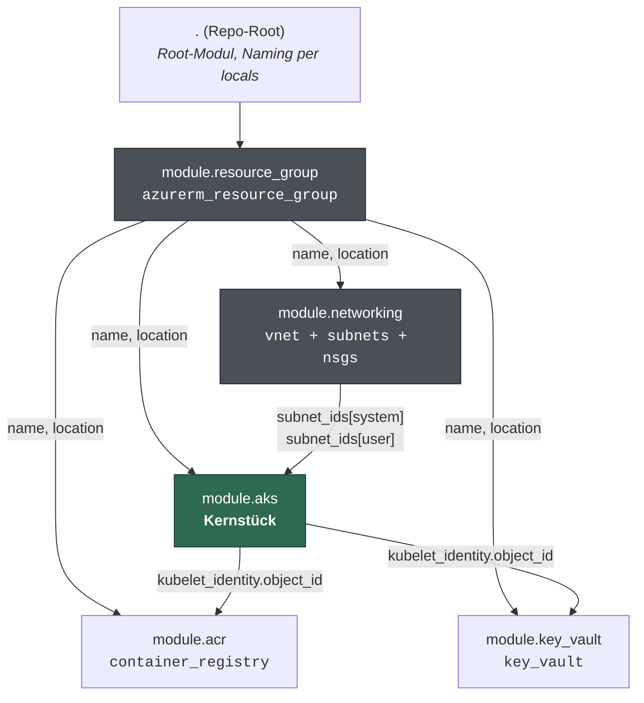
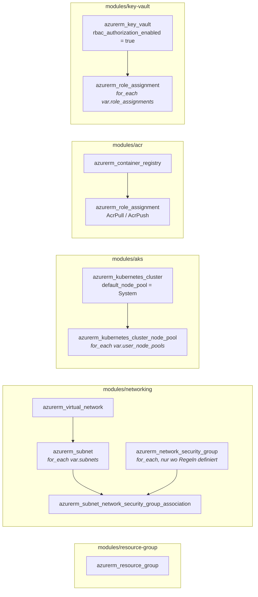
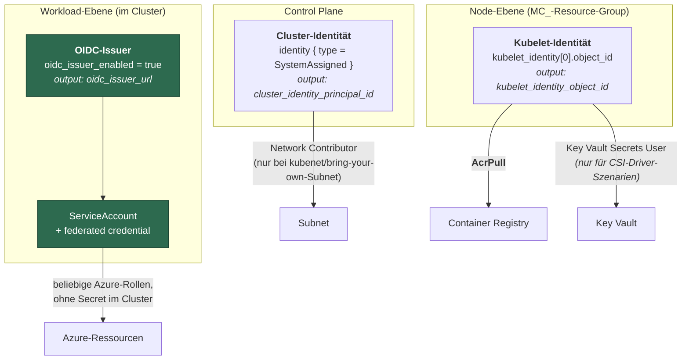
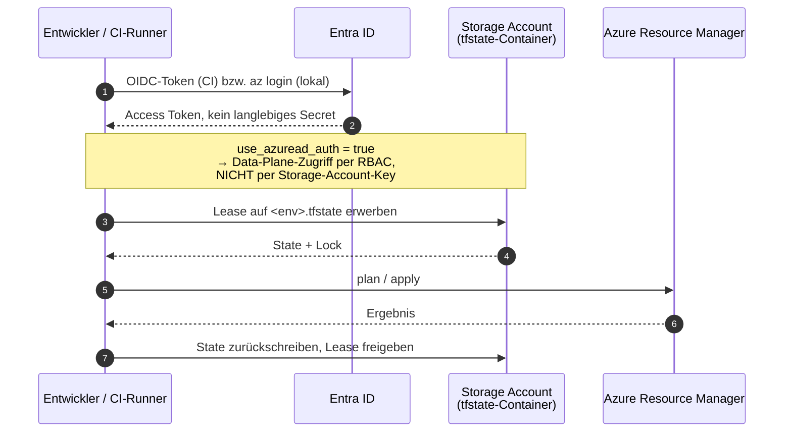
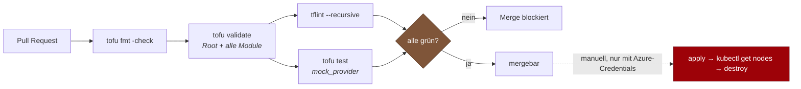
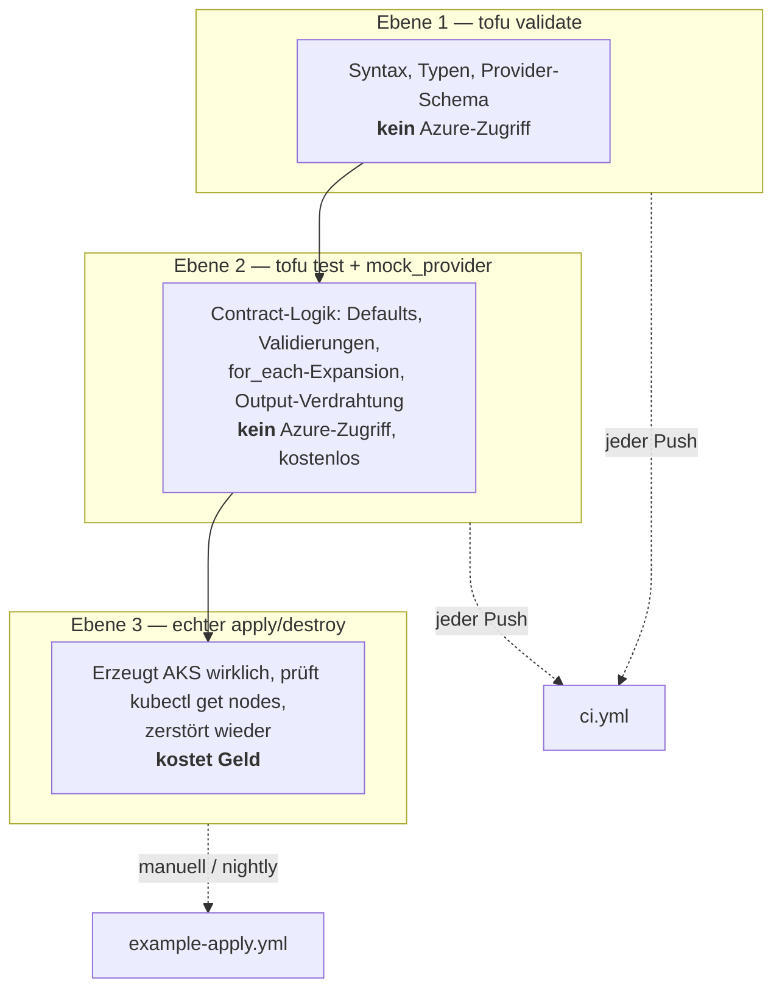
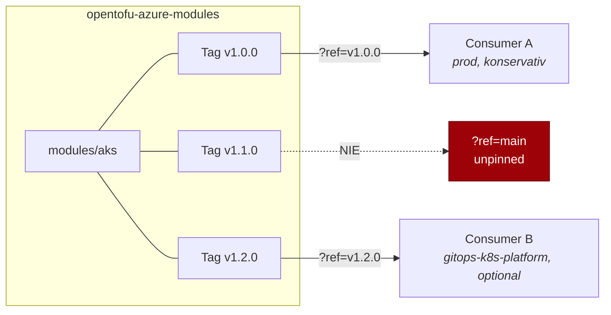

# Architektur

Die Diagramme zum Aufbau. Konventionen und Modul-Contract stehen in
[`../CONTRIBUTING.md`](../CONTRIBUTING.md).

- [1. Modul-Abhängigkeitsgraph](#1-modul-abhängigkeitsgraph)
- [2. Was jedes Modul erzeugt](#2-was-jedes-modul-erzeugt)
- [3. AKS-Identitäten](#3-aks-identitäten)
- [4. State-Backend-Flow](#4-state-backend-flow)
- [5. CI-Pipeline](#5-ci-pipeline)
- [6. Test-Strategie: mock vs. echt](#6-test-strategie-mock-vs-echt)
- [7. Versionierung & Konsum](#7-versionierung--konsum)

---

## 1. Modul-Abhängigkeitsgraph

Die Kanten sind **Datenflüsse**, keine `depends_on`-Deklarationen. OpenTofu leitet die
Reihenfolge aus genau diesen Referenzen ab — im Repo steht kein einziges explizites
`depends_on` zwischen den Modulen.



**Die beiden interessanten Kanten** sind die unteren: `aks → acr` und `aks → key_vault`. Sie sind
der Grund, weshalb ACR und Key Vault *nach* AKS angelegt werden, obwohl man sie intuitiv als
„Basis" einsortieren würde. Der AKS-Cluster erzeugt seine Kubelet-Identität selbst; erst wenn die
existiert, kann sie ein `AcrPull`- bzw. `Key Vault Secrets User`-Assignment bekommen.

Wer diese Reihenfolge umdreht, landet bei einem Henne-Ei-Problem und greift dann meist zu
`azurerm_user_assigned_identity` vorab plus `identity { type = "UserAssigned" }`. Das ist eine
legitime Alternative — siehe [ADR 0006](adr/0006-kubelet-identity-statt-vorab-identity.md) für die
Begründung, warum dieses Repo den einfacheren Weg geht.

---

## 2. Was jedes Modul erzeugt



Bewusst **nicht** in den Modulen: `provider`-Blöcke, `backend`-Blöcke, hartkodierte Namen,
`azurerm_client_config`-Lookups (der Tenant kommt als Variable herein, damit das Modul auch unter
`mock_provider` planbar bleibt).

---

## 3. AKS-Identitäten

Drei verschiedene Identitäten, die regelmäßig verwechselt werden. Das ist der Kern dessen, was
das `aks`-Modul richtig machen muss.



| Identität | Wofür | Wer vergibt Rollen |
|---|---|---|
| **Cluster-Identität** | Control Plane verwaltet Azure-Ressourcen (LBs, Disks, Subnet-Joins) | Root, falls das Subnet in einer anderen RG liegt |
| **Kubelet-Identität** | Node zieht Images, mountet Secrets via CSI | `modules/acr` (AcrPull), `modules/key-vault` |
| **Workload Identity** | Pod authentisiert sich *ohne* Secret gegen Azure | Consumer, pro Anwendung |

**Warum `oidc_issuer_enabled` und `workload_identity_enabled` fest auf `true` stehen** und nicht
als Variable exponiert sind: sie sollen immer aktiv sein, ohne abschaltbares Feature-Flag.
Ein Flag, das man auf `false` stellen kann, wird irgendwann auf `false` gestellt — und dann
brauchen die Workloads wieder Client-Secrets. Siehe
[ADR 0004](adr/0004-oidc-workload-identity-immer-aktiv.md).

---

## 4. State-Backend-Flow

Kein State im Repo. Kein Access Key. Der Backend-Block steht **nur** im Root-Modul, nie in einem
`modules/*`-Verzeichnis.

> **Noch nicht eingerichtet.** `backend.tf` ist gitignored; ohne die Datei hält OpenTofu den
> State lokal. Der Ablauf unten ist die Vorgabe für den Moment, in dem das Remote-Backend
> gebaut wird.



Die relevanten Schalter, wenn `backend.tf` angelegt wird:

```hcl
terraform {
  backend "azurerm" {
    use_azuread_auth = true   # RBAC statt Storage-Account-Key
    use_oidc         = true   # In CI: Federated Credential, kein Client-Secret
    # storage_account_name / container_name / key / resource_group_name
    # kommen per -backend-config, nie aus dem Repo
  }
}
```

Die ausführende Identität braucht auf dem Container die Rolle **Storage Blob Data Contributor**.
`Contributor` auf dem Storage Account reicht *nicht* — das ist eine Control-Plane-Rolle und
erlaubt keinen Blob-Data-Zugriff, wenn man den Key-Zugriff (wie hier) abgeschaltet hat.

---

## 5. CI-Pipeline

Zwei **Azure-DevOps**-Pipelines unter [`../pipelines/`](../pipelines/); die frühere
GitHub-Actions-Umsetzung wurde entfernt ([ADR 0009](adr/0009-vereinfachtes-repo-layout.md)).
Was sie tun und warum: [`pipeline.md`](pipeline.md). Einrichtung Schritt für Schritt:
[`deployment.md`](deployment.md).

**Noch kein grüner Lauf** — die Definitionen sind geschrieben, aber ungetestet. Die Gates
lassen sich jederzeit lokal ausführen, siehe [`../CONTRIBUTING.md`](../CONTRIBUTING.md).



Der PR-Lauf kostet nichts und braucht keine Azure-Credentials — das ist der Grund für die
`mock_provider`-Strategie. Der Apply-Lauf ist bewusst *getrennt*: er kostet Geld, braucht
Credentials und darf nicht bei jedem Push starten.

Die Anforderungen an den Apply-Lauf, die beim Bau der Pipeline zu übernehmen sind, stehen in
[ADR 0008](adr/0008-mock-provider-in-ci.md): `destroy` läuft auch nach einem gescheiterten
`apply`, keine parallelen Läufe auf demselben State-Key, ein eigener State-Key pro Lauf, und
ein Abschluss-Check auf verwaiste Resource Groups und soft-deleted Key Vaults.

---

## 6. Test-Strategie: mock vs. echt



Was Ebene 2 **nicht** kann und daher Ebene 3 braucht: ob Azure die Kombination aus SKU, Region und
Kubernetes-Version tatsächlich akzeptiert, ob das AcrPull-Assignment greift, und ob der Cluster
Nodes hochfährt. `mock_provider` prüft die *Konfigurationslogik*, nicht die *Realität*.

Was Ebene 2 sehr wohl kann und Ebene 3 zu teuer für ist: alle `validation`-Blocks negativ testen,
jede `for_each`-Verzweigung durchspielen, und das in Sekunden statt in 15 Minuten pro Cluster.
Konkret sind es **168 Testfälle, davon 91 Negativtests**.

Ebene 2 hat zusätzlich eine eigene Kompositionsstufe: `tests/composition.tftest.hcl` plant das
Root-Modul und prüft damit, was kein Einzelmodul sehen kann — abgeleitete Namen gegen die je
Service unterschiedlichen Azure-Regeln (ACR ohne Bindestriche, Key Vault max. 24 Zeichen), die
`cidrsubnet`-Ableitung der Subnets, und die AcrPull-/Key-Vault-RBAC-Verdrahtung.

Die beiden Grenzen von `mock_provider`, die die Testform prägen: ein Mock liefert keine
berechneten Attribute (daher lösen die Kubelet-Identity-Outputs unter Test zu `null` auf statt
den Plan abzubrechen), und er validiert keine Werte gegen Azure. Konventionen für neue
Testdateien: [`../CONTRIBUTING.md`](../CONTRIBUTING.md).

---

## 7. Versionierung & Konsum

Kein Registry-Hosting, Versionierung über Git-Tags. Ein Consumer pinnt exakt:

```hcl
module "aks" {
  source = "git::https://github.com/<owner>/opentofu-azure-modules.git//modules/aks?ref=v1.2.0"

  # ...
}
```



Ein Tag umspannt das ganze Repo, nicht einzelne Module — bei fünf Modulen mit gemeinsam
weiterentwickelten Contracts ist das ehrlicher als fünf unabhängige Tag-Reihen. Ein `aks`-Tag
`v1.2.0` bedeutet also: „`aks` in dem Zustand, in dem das Repo bei `v1.2.0` war". Siehe
[ADR 0002](adr/0002-git-tags-statt-registry.md).
