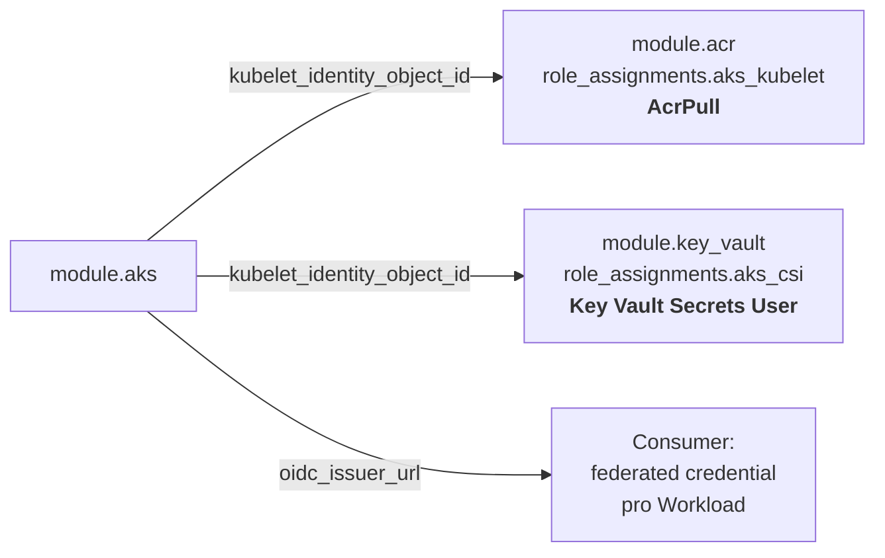

# Phase 4 — `modules/acr` und `modules/key-vault`

Voraussetzung: Phase 3 fertig — beide Module konsumieren
`module.aks.kubelet_identity_object_id`.

---

## 1. `modules/acr`

### Contract — Inputs

| Input | Typ | Default | Zweck |
|---|---|---|---|
| `name` | `string` | — | **Nur alphanumerisch**, 5–50 Zeichen — kein `-`! |
| `resource_group_name` | `string` | — | |
| `location` | `string` | — | |
| `sku` | `string` | `"Basic"` | `Basic`/`Standard`/`Premium` |
| `admin_enabled` | `bool` | `false` | Bleibt aus: das Admin-Konto ist ein geteiltes Passwort |
| `public_network_access_enabled` | `bool` | `true` | Premium-only wenn `false` sinnvoll kombiniert |
| `anonymous_pull_enabled` | `bool` | `false` | |
| `zone_redundancy_enabled` | `bool` | `false` | Premium-only |
| `retention_policy_in_days` | `number` | `null` | Premium-only |
| `trust_policy_enabled` | `bool` | `false` | Premium-only |
| `georeplications` | `list(object)` | `[]` | Premium-only |
| `role_assignments` | `map(object)` | `{}` | Der eigentliche Integrationspunkt, siehe unten |
| `tags` | `map(string)` | `{}` | |

`role_assignments` — Map `key → { principal_id, role, principal_type? }`:

```hcl
role_assignments = {
  aks_kubelet = {
    principal_id   = module.aks.kubelet_identity_object_id
    role           = "AcrPull"
    principal_type = "ServicePrincipal"
  }
  ci_push = {
    principal_id = var.ci_principal_id
    role         = "AcrPush"
  }
}
```

Warum eine generische Map statt eines dedizierten `aks_kubelet_object_id`-Inputs: das Modul soll
nicht wissen, dass es AKS gibt. Ein `AcrPull` für eine Container-App oder einen CI-Runner ist
derselbe Vorgang. Der ACR-Modul-Contract bleibt damit AKS-frei — Prinzip „Module, nicht Monolith"
(Prinzip: ein Modul, ein Zweck).

### Validierungen

- `name`: `^[a-zA-Z0-9]{5,50}$`. Das ist die häufigste ACR-Stolperfalle — die Namenskonvention
  `<project>-<env>-acr` aus §4 funktioniert hier **nicht** und muss im Root zu
  `<project><env>acr` normalisiert werden. Die Validierung macht das explizit statt es im
  `apply` zu verstecken.
- `sku` ∈ {Basic, Standard, Premium}.
- Premium-only-Features (`zone_redundancy_enabled`, `retention_policy_in_days`,
  `trust_policy_enabled`, nicht-leere `georeplications`) verlangen `sku == "Premium"` —
  Cross-Variable-Validierung, sonst ist die Fehlermeldung von Azure kryptisch.
- `role_assignments`: jede `principal_id` ist eine GUID; `role` nicht leer.

### Outputs

`id`, `name`, `login_server`, `role_assignment_ids` (Map).

`admin_username`/`admin_password` werden **nicht** exponiert — wer sie braucht, hat das falsche
Auth-Modell (siehe [ADR 0005](../adr/0005-acr-ohne-admin-konto.md)).

---

## 2. `modules/key-vault`

### Contract — Inputs

| Input | Typ | Default | Zweck |
|---|---|---|---|
| `name` | `string` | — | 3–24 Zeichen, `^[a-zA-Z][a-zA-Z0-9-]*$`, kein `--` |
| `resource_group_name` | `string` | — | |
| `location` | `string` | — | |
| `tenant_id` | `string` | — | **Als Input, nicht per Datasource** — siehe Entscheidungen |
| `sku_name` | `string` | `"standard"` | `standard`/`premium` (HSM) |
| `soft_delete_retention_days` | `number` | `7` | 7–90; 7 = billigster Wiederherstellungspuffer |
| `purge_protection_enabled` | `bool` | `false` | **Default aus**, siehe Entscheidungen |
| `public_network_access_enabled` | `bool` | `true` | |
| `enabled_for_disk_encryption` | `bool` | `false` | |
| `enabled_for_deployment` | `bool` | `false` | |
| `enabled_for_template_deployment` | `bool` | `false` | |
| `network_acls` | `object` | `null` | `default_action`, `bypass`, IP-/Subnet-Regeln |
| `role_assignments` | `map(object)` | `{}` | Wie bei ACR |
| `tags` | `map(string)` | `{}` | |

`rbac_authorization_enabled` ist **nicht** exponiert — hartkodiert `true`. Das Repo verlangt
„RBAC statt Access Policies"; ein `access_policy`-Block existiert im Modul gar nicht.

### Entscheidungen

- **`tenant_id` ist ein Input, kein `data "azurerm_client_config"`.** Eine Datasource würde das
  Modul beim `tofu test` mit `mock_provider` unplanbar machen (Mock-Datasources liefern
  Platzhalter, und der Tenant landet dann im Plan-Diff). Ein Input ist außerdem ehrlicher: das
  Modul *braucht* die Information, also soll sie im Contract stehen.
- **`purge_protection_enabled` default `false`.** Sicherheitstechnisch wäre `true` besser, aber
  Purge Protection ist **irreversibel** und hält den Vault-Namen 7–90 Tage blockiert. Ein Repo,
  dessen DoD „rückstandsfrei zerstörbar" lautet (§7), kann das nicht als Default haben — der
  CI-Apply-Test wäre beim zweiten Lauf tot. Für Produktion: einschalten. So dokumentiert im README.
- **Rollen per Name, nicht per ID.** `role_definition_name = "Key Vault Secrets User"` ist lesbar;
  `role_definition_id` wäre eine GUID ohne Bedeutung im Diff.

### Validierungen

- `name`: 3–24 Zeichen, beginnt mit Buchstabe, nur alphanumerisch + `-`, kein `--`, endet nicht
  auf `-`.
- `sku_name` ∈ {standard, premium}.
- `soft_delete_retention_days` zwischen 7 und 90.
- `tenant_id` ist eine GUID.
- `network_acls.default_action` ∈ {Allow, Deny}; `bypass` ∈ {AzureServices, None}.
- `role_assignments`: `principal_id` GUID-förmig, `role` nicht leer.

### Outputs

`id`, `name`, `vault_uri`, `role_assignment_ids`.

---

## 3. Integration — was Phase 4 wirklich beweist

Die Module selbst sind unspektakulär. Der Punkt dieser Phase ist die **Verdrahtung**, und die wird
im Beispiel-Root (Phase 5) so aussehen:



Der Key-Vault-Zugriff über die *Kubelet*-Identität ist dabei bewusst der schwächere Pfad — er gilt
für den Secrets-Store-CSI-Driver, wo alle Pods auf dem Node dieselbe Identität nutzen. Der
eigentlich richtige Weg für Anwendungen ist Workload Identity über `oidc_issuer_url`, pro
ServiceAccount. Das gehört aber in den Consumer, nicht in dieses Repo (keine
Kubernetes-Workloads).

---

## 4. Tests

**`modules/acr/tests/`**
- Defaults: `admin_enabled` ist `false`, auch wenn der Consumer nichts gesagt hat.
- Leere `role_assignments` → keine `azurerm_role_assignment`-Instanz.
- Zwei Assignments → zwei Instanzen mit den erwarteten Keys und Rollennamen.
- Negativ: Name mit `-`, Name zu kurz, `sku = "Free"`, `zone_redundancy_enabled = true` bei Basic,
  nicht-leere `georeplications` bei Basic, `principal_id` keine GUID.

**`modules/key-vault/tests/`**
- `rbac_authorization_enabled` ist `true` — Consumer kann es nicht abschalten.
- Defaults: `soft_delete_retention_days = 7`, `purge_protection_enabled = false`.
- `network_acls = null` → kein `network_acls`-Block im Plan; gesetzt → Block mit `default_action`.
- Role Assignments wie bei ACR.
- Negativ: Name mit `--`, Name beginnt mit Ziffer, Name 25 Zeichen,
  `soft_delete_retention_days = 6`, `sku_name = "Standard"` (Großschreibung!),
  `default_action = "Reject"`, `tenant_id = "nope"`.

---

## 5. DoD

- `modules/acr/` und `modules/key-vault/` vollständig nach Modul-Contract.
- Kein `access_policy`-Block im Key-Vault-Modul; `rbac_authorization_enabled` hartkodiert `true`.
- Kein `admin_username`/`admin_password`-Output im ACR-Modul.
- Weder Modul referenziert AKS begrifflich — Integration läuft über generische
      `role_assignments`.
- `tofu -chdir=modules/acr test && tofu -chdir=modules/key-vault test` grün, Positiv- und Negativ-Tests.
- `tofu init -backend=false && tofu validate` und `tflint --recursive` grün.
