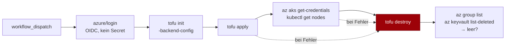

# Phase 6 — Tests & CI

## 1. Test-Layout

Testdateien liegen am Repo-Root unter `tests/<modul>/`, **nicht** in den
Modulverzeichnissen:

```
tests/
├─ resource-group/{defaults,validation}.tftest.hcl
├─ networking/{subnets,nsg,validation}.tftest.hcl
├─ aks/{defaults,identity,node_pools,validation}.tftest.hcl
├─ acr/{defaults,role_assignments,validation}.tftest.hcl
├─ key-vault/{rbac,validation}.tftest.hcl
└─ example-aks-cluster/composition.tftest.hcl
```

Note the last entry: the **example root is tested too**, under `example-<basename>` so it
never collides with a module's directory. That layer catches what neither `validate` nor the
per-module tests can — derived names that violate a service's own rules (ACR forbids hyphens,
Key Vault caps at 24 characters), CIDR arithmetic, and the AcrPull / Key-Vault-RBAC wiring
that is the entire point of the example.

`tofu test` sucht standardmäßig in `./tests` **relativ zum Modul**. Da die Tests hier außerhalb
liegen, braucht jeder Lauf `-test-directory`:

```bash
tofu -chdir=modules/aks test -test-directory=../../tests/aks
```

Das kapselt `tofu test / tofu -chdir=modules/<name> test`, damit niemand den Pfad von Hand tippen muss. Relative Pfade mit
`..` funktionieren — verifiziert mit OpenTofu 1.11.

> **Trade-off, bewusst:** Tests im Modulverzeichnis wären ergonomischer (`tofu test` ohne Flags).
> Die Repo-Root-Variante hält die Module aber schlank für Consumer, die per
> `?ref=vX.Y.Z//modules/aks` genau ein Unterverzeichnis ziehen — Testdateien landen dann nicht im
> Konsum-Pfad. Die Tests sind später in die Modulverzeichnisse gewandert, siehe
> [ADR 0009](../adr/0009-vereinfachtes-repo-layout.md).

## 2. Mock-Provider

Jede Testdatei beginnt mit:

```hcl
mock_provider "azurerm" {}
```

Damit braucht `tofu test` **keine** Subscription, kein Login, keine `features {}`-Konfiguration —
und kostet nichts. `command = plan` in jedem `run`-Block; es wird nie wirklich appliziert.

Was das kann: Defaults prüfen, `validation`-Blocks negativ prüfen, `for_each`-Expansion zählen,
Output-Verdrahtung prüfen, hartkodierte Invarianten wie `oidc_issuer_enabled = true` festnageln.

Was das **nicht** kann: bestätigen, dass Azure die Konfiguration akzeptiert. Dafür Phase 5 §6.

### Zwei Grenzen von `mock_provider`, die man kennen muss

Beide sind mit OpenTofu 1.11.4 verifiziert und prägen, wie die Testdateien aussehen:

1. **Computed-only Blöcke lassen sich nicht injizieren.** `azurerm_kubernetes_cluster.kubelet_identity`
   ist ein Block, der nur vom Provider gefüllt wird. Unter Mock kommt er als *leere Liste* zurück,
   und weder `mock_resource` noch `override_resource` kann ihn setzen (`Cannot override block value,
   because it's not present in configuration`). Folgen: das `aks`-Modul braucht in `main.tf` einen
   dokumentierten Fallback, damit `kubelet_identity[0]` den Plan nicht abbricht — und der
   Kompositionstest ersetzt `module.aks` per **`override_module`** mit festen Outputs, weil sonst
   die nachgelagerten Role Assignments an einer fehlenden `principal_id` scheitern.
   Unterschied bei der Syntax: Block-Felder werden mit einem **Objekt** überschrieben,
   computed List-Attribute (`kube_config`) mit einer **Liste**.

2. **`null` in der Konfiguration ist im Plan nicht `null`.** Ein Optional+Computed-Attribut, das das
   Modul bewusst *nicht* sendet, erscheint als Provider-Nullwert (`node_count` → `0`) oder als
   mock-generierter Zufallsstring (`pod_cidr`). `assert { condition = x == null }` ist daher
   unbrauchbar. Stattdessen: einen auffälligen **Sentinel-Wert** hineingeben und auf Ungleichheit
   prüfen — das testet die eigentliche Aussage („das Modul reicht den Wert nicht weiter") präziser
   als ein Null-Vergleich.

### Negativ-Tests

```hcl
run "rejects_bad_version" {
  command = plan

  variables {
    kubernetes_version = "1.30-lts"
  }

  expect_failures = [var.kubernetes_version]
}
```

Ein Modul mit `validation`-Blocks, die nie negativ getestet werden, hat effektiv keine
Validierung — ein Tippfehler in der `condition` fällt sonst nie auf. Jede Regel aus den Specs
bekommt daher ihren Negativ-Test.

---

## 3. `ci.yml` — der PR-Gate

Läuft bei `push` auf `main` und bei jedem `pull_request`. Keine Secrets, keine Azure-Berechtigung.

| Job | Kommando | Blockiert Merge |
|---|---|---|
| `fmt` | `tofu fmt -check -recursive` | ja |
| `validate` | `tofu init -backend=false && tofu validate` | ja |
| `tflint` | `tflint --init && tflint --recursive` | ja |
| ~~`checkov`~~ | entfällt | — |
| `test` | `tofu test / tofu -chdir=modules/<name> test` (Matrix über die 5 Module) | ja |
| ~~`docs`~~ | entfällt, READMEs sind handgeschrieben | — |

Details, die zählen:

- **`permissions: contents: read`** als Job-Default. Der PR-Workflow braucht nichts weiter; ein
  `write`-Token in einem Workflow, der PR-Code ausführt, ist ein bekannter Angriffsvektor.
- **`tofu test` als Matrix** über die fünf Module: ein rotes Modul ist im Job-Namen sofort sichtbar,
  statt in 300 Zeilen Sammel-Log zu verschwinden.
- **`concurrency`-Gruppe pro Ref** mit `cancel-in-progress: true` — sonst stapeln sich Läufe bei
  schneller Push-Folge.
- **Provider-Cache** über `actions/cache` auf `~/.terraform.d/plugin-cache`, gekeyt auf die
  `.terraform.lock.hcl`-Dateien. Ohne das lädt jeder der ~11 Jobs den 100-MB-azurerm-Provider neu.
- **Versionen gepinnt**: `opentofu_version`, `tflint`-Version, `terraform-docs`-Version als
  Workflow-Env. Ein „latest" in CI heißt: irgendwann bricht der Build ohne Code-Änderung.

---

## 4. `example-apply.yml` — der echte Nachweis

Getrennter Workflow. `workflow_dispatch` (manuell) plus optional `schedule` (nightly).
**Nie** bei `pull_request` — sonst kann ein fremder PR Azure-Ressourcen in deiner Subscription
anlegen.



Die entscheidende Eigenschaft: **`destroy` läuft mit `if: always()`.** Wenn `apply` auf halber
Strecke scheitert, existieren trotzdem schon Ressourcen — ein Workflow, der dann einfach abbricht,
hinterlässt einen laufenden AKS-Cluster. Das verletzt §7 direkt und kostet echtes Geld.

Weitere Punkte:

- **Auth per OIDC.** `permissions: id-token: write` + `azure/login` mit
  `client-id`/`tenant-id`/`subscription-id` als Variablen (keine Secrets — es sind keine).
  Kein `creds`-JSON, kein Client-Secret (§5, §7 der Arbeitsweise).
- **`environment: azure-apply`** mit Required Reviewer. Damit kann kein versehentlicher
  Dispatch Kosten auslösen.
- **`concurrency`-Gruppe ohne `cancel-in-progress`.** Ein abgebrochener Apply-Lauf ist genau das
  Szenario, das verwaiste Ressourcen produziert; zwei parallele Läufe auf demselben State-Key
  wären noch schlimmer.
- **Eindeutiger State-Key pro Lauf** (`ci-${{ github.run_id }}.tfstate`), damit ein hängender Lease
  aus einem früheren Lauf den nächsten nicht blockiert.
- **Abschluss-Check** nach dem Destroy: `az group list` und `az keyvault list-deleted` müssen leer
  sein. Ein Destroy, der „erfolgreich" meldet, aber einen soft-deleted Vault hinterlässt, ist nicht
  rückstandsfrei — und blockiert den Namen beim nächsten Lauf.

---

## 5. `release.yml` — Tags

Jedes Modul braucht mindestens einen Versions-Tag (§9). Ein Tag `vX.Y.Z` umspannt das ganze Repo
([ADR 0002](../adr/0002-git-tags-statt-registry.md)). Der Workflow reagiert auf `push` von
`v*`-Tags, prüft, dass `ci.yml` für diesen Commit grün war, und erzeugt eine GitHub-Release-Notiz
mit den Consumer-Snippets:

```hcl
module "aks" {
  source = "git::https://github.com/<owner>/opentofu-azure-modules.git//modules/aks?ref=vX.Y.Z"
}
```

Tags werden **manuell** gesetzt (der Repo-Owner committet und taggt selbst) — der Workflow taggt
nicht von sich aus.

---

## 6. DoD

- `tests/<modul>/` für alle fünf Module, je mit Positiv- **und** Negativ-Tests.
- `tofu test / tofu -chdir=modules/<name> test` grün, ohne Azure-Credentials.
- `.github/workflows/ci.yml` mit den sechs Jobs aus §3, Versionen gepinnt,
      `permissions: contents: read`, Provider-Cache aktiv.
- `.github/workflows/example-apply.yml` mit `workflow_dispatch`, OIDC-Auth,
      `destroy` unter `if: always()`, Rückstands-Check.
- `.github/workflows/release.yml` für `v*`-Tags.
- Kein Workflow mit `pull_request_target`, kein langlebiges Azure-Credential in Secrets.
- `.pre-commit-config.yaml` lokal lauffähig (`pre-commit run --all-files`).
